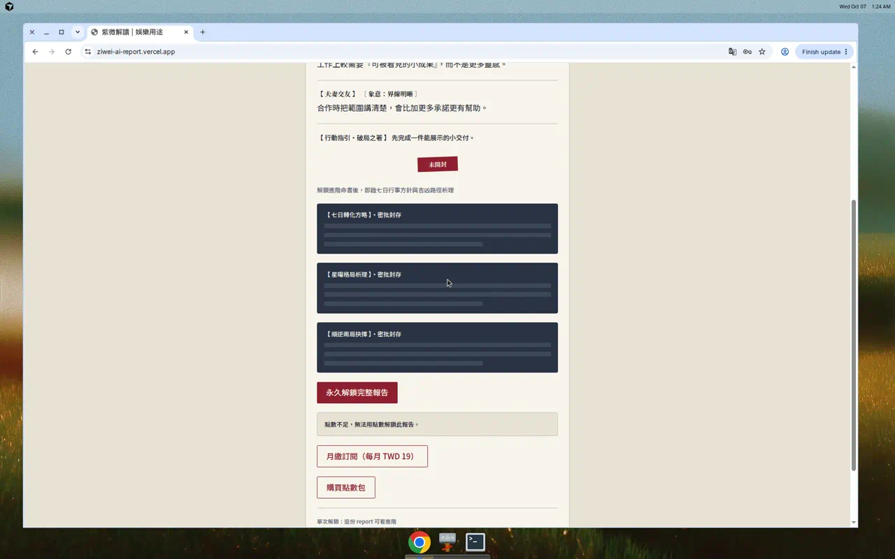
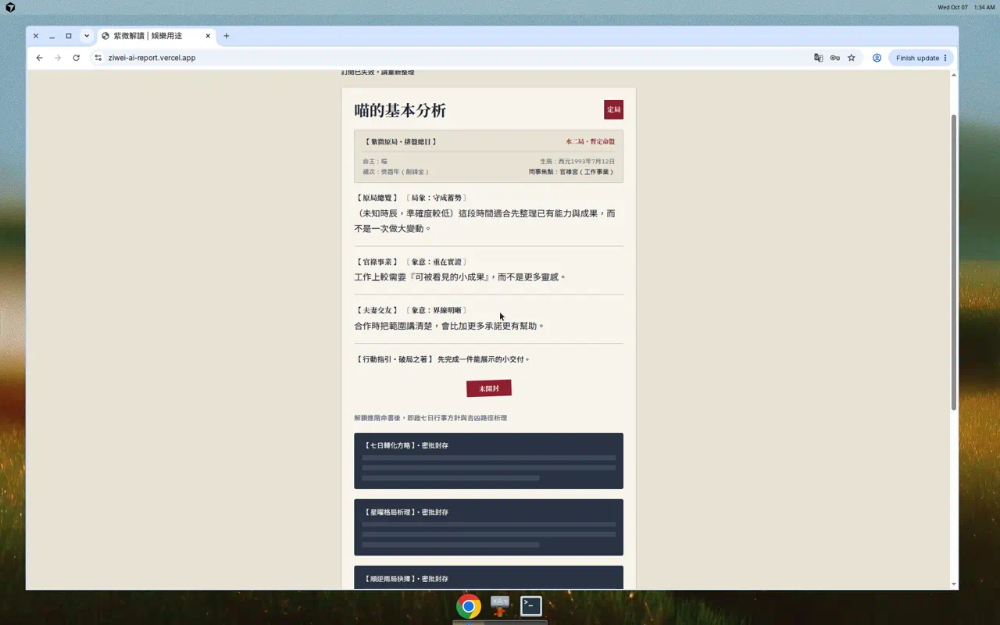
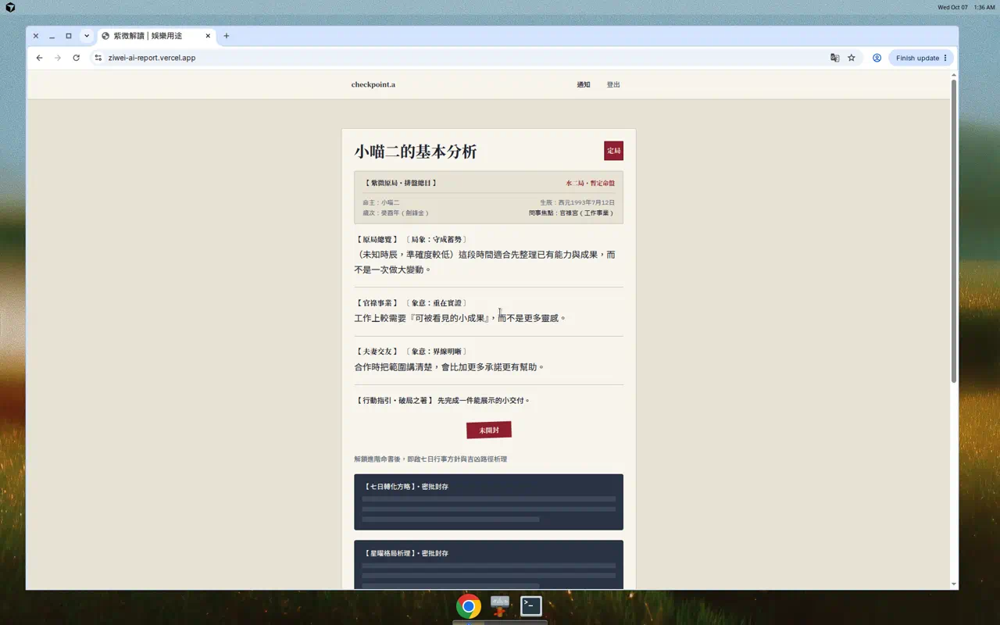
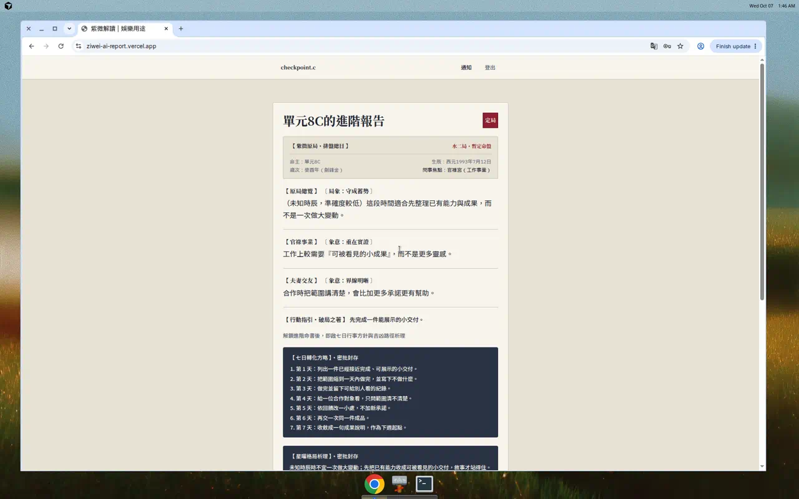
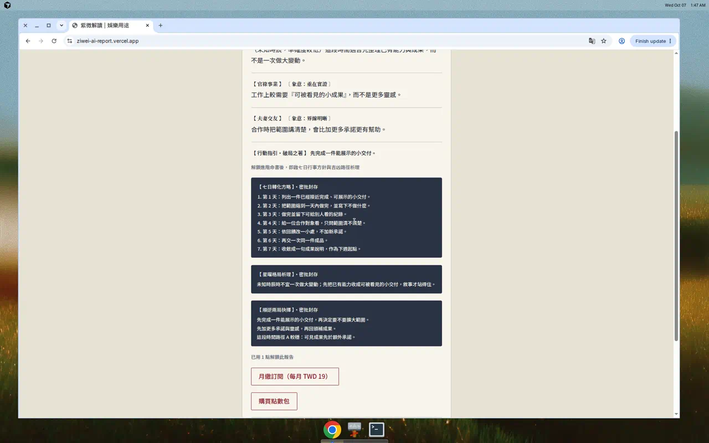

# 單元 8 真機驗收紀錄（2026-10-07）

> 2026-10-07 在演示站 `https://ziwei-ai-report.vercel.app` 實跑單元 8。三種模式都跑完，13 列通過。HashKey、HashIV、Cookie、anon key 不寫在這份紀錄。
## 結果
- 矩陣：`docs/unit8/verification-matrix.md`（13 列勾通過，處置欄留空）
- US-009、US-010：PASS
- PR：https://github.com/ms0223900/ziwei-ai-report/pull/97
- 產品程式沒有改。`app/`、`lib/`、`supabase/migrations/` 相對 `origin/main` 無 diff。
## 帳號
密碼都是 `Test1234`。Supabase 專案 `pjwzqyaglwhtugmouwmu`。
<table fit-page-width="true" header-row="true">
	<tr>
		<td>帳號</td>
		<td>email</td>
		<td>UUID</td>
		<td>這次負責</td>
	</tr>
	<tr>
		<td>A</td>
		<td>checkpoint.a@aaa.com</td>
		<td>77ba05f6-21c3-41b4-8e84-e920aae1df44</td>
		<td>先 F3，reset 後再取消</td>
	</tr>
	<tr>
		<td>B</td>
		<td>checkpoint.b@aaa.com</td>
		<td>84ca06c5-10fb-4478-a6d9-ab52973f7c2f</td>
		<td>U8-S-F1</td>
	</tr>
	<tr>
		<td>C</td>
		<td>checkpoint.c@aaa.com</td>
		<td>4dc205b3-b4a8-43ce-ba3c-8727fe027a03</td>
		<td>到期與 U8-S-F4</td>
	</tr>
	<tr>
		<td>D</td>
		<td>checkpoint.d@aaa.com</td>
		<td>fc5f35a3-8e99-416b-a422-cb645feb0031</td>
		<td>單次、點數、通知、月繳成功</td>
	</tr>
	<tr>
		<td>ADMIN</td>
		<td>admin_test.a@aaa.com</td>
		<td>a6583f5f-f0a5-4617-9bf8-e4b69355520f</td>
		<td>只看 `/admin/orders`</td>
	</tr>
</table>
## 這次實跑順序
F3 必須在「重跑 reset、再取消 A」之前。點數順序是 P-F → P-S／P-D → N-F。
1. 開場 reset 後先 probe A（200）與 B、C（403）。
2. D 做單次：pending、failed、simulate、bad-mac、成功、重送。
3. D 做點數不足、加點、重送、已履約但無通知。
4. A 開著首頁時 `expire.sql`，再產生報告（F3）。同時 B 送兩次扣款失敗。
5. C 用 1 點解鎖新報告（F4）。
6. 為了留下仍可查的單次證據，在 reset 前又對當時的 pending 單補了一次成功與重送，接著重跑 fixture 做 failed。
7. `reset-checkpoint.sql`。
8. A 跑兩次 `cancel.sql`。
9. D 真實 checkout 月繳，return 送兩次。
## 共用指令
Hash 只從 gitignore 的 `.env.local` 讀。下面不貼 key。
```bash
export BASE=https://ziwei-ai-report.vercel.app
payload() { node --env-file=.env.local scripts/ecpay-subscription-payload.mjs "$@"; }
post() { curl -sS -X POST "$BASE$1" -H 'Content-Type: application/x-www-form-urlencoded' --data "$2"; echo; }
```
登入用 `@supabase/ssr` 的 `createBrowserClient` 加記憶體 cookie jar，`signInWithPassword` 後把 cookie 寫到模式 600 的暫存檔。probe 與頁面請求只帶那個檔，不把 cookie 貼進筆記。
SQL 都在 Supabase `execute_sql` 整段跑。會寫 `orders.status` 或 `points_balance` 的段落，同一筆交易先 `set_config` 成 `service_role`，否則 `orders_guard_status` 會擋。
結果頁與管理頁（把 `$ORDER`、cookie 檔換成該步的值）：
```bash
curl -sS "$BASE/api/orders/processing?order=$ORDER" -H "Cookie: $(cat /tmp/cookie-d.txt)"
curl -sS "$BASE/admin/orders?order=$ORDER" -H "Cookie: $(cat /tmp/cookie-admin.txt)"
```
## FR-2 開場 probe
reset 之後、F3 之前。
```bash
node scripts/unit8-checkpoint/probe.mjs advanced 3354ecbf-a227-44b3-8435-cda6a41ea216 --base "$BASE" --cookie "$(cat /tmp/cookie-a.txt)"
node scripts/unit8-checkpoint/probe.mjs advanced efbe239f-bbe7-442a-9cdd-af0ee29d01a9 --base "$BASE" --cookie "$(cat /tmp/cookie-b.txt)"
node scripts/unit8-checkpoint/probe.mjs advanced e96e5da7-ec0e-4e46-a099-bbe39f1225f0 --base "$BASE" --cookie "$(cat /tmp/cookie-c.txt)"
```
實際：A 為 `status: 200`、`unlock_mode: subscription`，沒有印進階本文。B、C 為 `status: 403`、`error_code: FORBIDDEN`。
## 單次解鎖
Fixture 檔 `scripts/unit8-checkpoint/fixture-lifetime-pending.sql`，整段執行。帳號 D。
```sql
begin;
select set_config('request.jwt.claim.role', 'service_role', true);
select set_config('request.jwt.claims', '{"role":"service_role"}', true);
delete from public.notifications
where source_id in (select id::text from public.orders where merchant_trade_no = 'TESTU8LIFE0001');
delete from public.admin_actions
where source_order_id in (select id from public.orders where merchant_trade_no = 'TESTU8LIFE0001');
delete from public.orders where merchant_trade_no = 'TESTU8LIFE0001';
update public.profiles
set access_status = 'locked'
where user_id = 'fc5f35a3-8e99-416b-a422-cb645feb0031';
with created as (
  insert into public.orders (user_id, plan_id, merchant_trade_no, amount, currency, status)
  values ('fc5f35a3-8e99-416b-a422-cb645feb0031', 'unlock_report_lifetime', 'TESTU8LIFE0001', 99, 'TWD', 'pending')
  returning id, user_id
)
insert into public.notifications (user_id, type, source_type, source_id, idempotency_key)
select user_id, 'order_pending', 'order', id::text, 'order-pending:' || id
from created;
commit;
select o.id as order_id, o.status, p.access_status
from public.orders o
join public.profiles p on p.user_id = o.user_id
where o.merchant_trade_no = 'TESTU8LIFE0001';
```
### U8-L-F pending
留下的訂單是 `178b0fe4-ebff-40b4-aa00-be39a4e63a7e`。processing：`accepted`／「付款已受理，正在確認」／primary `refresh`。admin「等待 Webhook」。`access_status=locked`，`unlock:` 0。
### U8-L-F failed
`scripts/post-payment-checkpoint/mark-failed.sql`，訂單 id 已代入。
```sql
begin;
select set_config('request.jwt.claim.role', 'service_role', true);
select set_config('request.jwt.claims', '{"role":"service_role"}', true);
update public.orders
set status = 'failed'
where id = '178b0fe4-ebff-40b4-aa00-be39a4e63a7e'
  and status = 'pending';
commit;
begin;
insert into public.notifications (user_id, type, source_type, source_id, idempotency_key)
select o.user_id, 'order_failed', 'order', o.id::text, 'order-failed:' || o.id
from public.orders o
where o.id = '178b0fe4-ebff-40b4-aa00-be39a4e63a7e'
  and o.status = 'failed'
on conflict (idempotency_key) do nothing;
commit;
```
實際：`status=failed`、`order-failed:` 1、`unlock:` 0、仍 locked。processing `incomplete`／「付款未完成，尚未變更權益」／primary `plans`。admin「無法處理」。
### simulate 與 bad-mac
在成功 payload 之前，對當時的 pending 單 `42019e45-b603-4555-be52-27189b3dc79d`：
```bash
post /api/payments/ecpay/webhook "$(payload --kind return --mtn TESTU8LIFE0001 --simulate --amount 99)"
post /api/payments/ecpay/webhook "$(payload --kind return --mtn TESTU8LIFE0001 --bad-mac --amount 99)"
```
實際：simulate `1|OK`，bad-mac `0|Error`。之後訂單仍 pending、locked、`unlock:` 0。
### U8-L-S 與 U8-L-D
同一筆 `42019e45-b603-4555-be52-27189b3dc79d`，simulate 之後才送成功。
```bash
post /api/payments/ecpay/webhook "$(payload --kind return --mtn TESTU8LIFE0001 --amount 99)"
post /api/payments/ecpay/webhook "$(payload --kind return --mtn TESTU8LIFE0001 --amount 99)"
```
兩次都 `1|OK`。查詢：`status=paid`、`access_status=unlocked`、`unlock:` 1 筆且 type 為 `unlock_completed`。processing `unlock_completed`／「完整解讀已解鎖」／primary `report`。admin「已履約」，頁面沒有「已履約但無通知」。
## 點數
### U8-P-F
`scripts/unit8-checkpoint/fixture-points-zero.sql` 整段執行。初始化段落把 D 設成 0 點、locked、無訂閱，並建報告 R。
實際報告 R：`575b23f7-ce4d-493b-a237-e5a143a7a0ff`。餘額 0、locked、`debit_unlock` 0、`report_unlocks` 0。
```bash
node scripts/unit8-checkpoint/probe.mjs unlock 575b23f7-ce4d-493b-a237-e5a143a7a0ff --base "$BASE" --cookie "$(cat /tmp/cookie-d.txt)"
```
實際：`status: 200`、`ok: false`、`reason: insufficient`。再查餘額仍 0，沒有 `debit_unlock`、`report_unlocks`、`report_unlocked`。
畫面：D 登入首頁，餘額「目前點數：0 點」。表單暱稱「單元8點數」、生日 `1993-07-12`、焦點「工作」，按「看基本分析」。鎖定區有「點數不足，無法用點數解鎖此報告。」，沒有「用 1 點解鎖此報告」，有「購買點數包」與「月繳訂閱（每月 TWD 19）」。

### U8-P-S 與 U8-P-D
`scripts/unit8-checkpoint/fixture-points-replay.sql` 整段執行。建出的 pending 單是 `ad1a6d2f-8667-43af-b5c0-5fbe0f2cfd07`，當時 credit 0、餘額 0。
```bash
post /api/payments/ecpay/webhook "$(payload --kind return --mtn TESTU8PTS0001 --amount 49)"
post /api/payments/ecpay/webhook "$(payload --kind return --mtn TESTU8PTS0001 --amount 49)"
```
兩次都 `1|OK`。查詢：
```sql
select o.id, o.status,
       (select count(*) from public.point_transactions t where t.source_order_id = o.id and t.type = 'credit_purchase') as credits,
       (select coalesce(sum(t.delta),0) from public.point_transactions t where t.source_order_id = o.id and t.type = 'credit_purchase') as delta_sum,
       p.points_balance,
       (select count(*) from public.notifications n where n.idempotency_key = 'credit:' || o.id::text) as credit_notifications
from public.orders o
join public.profiles p on p.user_id = o.user_id
where o.merchant_trade_no = 'TESTU8PTS0001';
```
實際：`paid`、credit 1、delta 5、餘額 5、`credit:` 1 筆 `credit_completed`。第二次沒有再加。processing `points_credited`／「已新增 5 點」。admin「已履約」。
### U8-N-F
`scripts/unit8-checkpoint/fixture-notification-missing.sql` 整段執行。它呼叫 `fulfill_points_pack_order`，再刪掉 `credit:{order id}`。訂單 `10cbbce0-962d-4d96-b553-d87cd18eaa73`：credit 1、`credit:` 0、餘額 10（含上一筆的 5 點）。processing 仍是「已新增 5 點」。admin「已履約但無通知」。D 僅存的 `credit_completed` 是上一筆 `ad1a6d2f-8667-43af-b5c0-5fbe0f2cfd07`。通知頁 HTML 不含這筆訂單 id。處置欄留空，補通知屬 Could。
## 訂閱
### U8-S-F3 頁面開著時到期
先用 A 登入並停在首頁表單，不要重新整理。另開 SQL，把 `<USER uuid>` 換成 A：
```sql
update public.subscriptions
set current_period_end = now() - interval '1 minute'
where user_id = '77ba05f6-21c3-41b4-8e84-e920aae1df44';
select status, current_period_end < now() as expired
from public.subscriptions where user_id = '77ba05f6-21c3-41b4-8e84-e920aae1df44';
```
實際：`status` 仍 `active`，`expired=true`，期末 `2026-10-07 01:29:59`。
回到原頁，不重新整理，產生報告。出現「訂閱已失效，請重新整理」，進階是未開封，沒有白屏。

重新整理後再產生「小喵二」，仍鎖定。

到期前那份報告再 probe 為 `403`：
```bash
node scripts/unit8-checkpoint/probe.mjs advanced 3354ecbf-a227-44b3-8435-cda6a41ea216 --base "$BASE" --cookie "$(cat /tmp/cookie-a.txt)"
```
### U8-S-F1 扣款失敗
reset 後 B 已是 `past_due`，期末是昨天。報告 `efbe239f-bbe7-442a-9cdd-af0ee29d01a9`。
```bash
node scripts/unit8-checkpoint/probe.mjs advanced efbe239f-bbe7-442a-9cdd-af0ee29d01a9 --base "$BASE" --cookie "$(cat /tmp/cookie-b.txt)"
post /api/payments/ecpay/period-webhook "$(payload --mtn TESTSUBB0001 --rtn-code 10100058 --gwsr GU8B1)"
post /api/payments/ecpay/period-webhook "$(payload --mtn TESTSUBB0001 --rtn-code 10100058 --gwsr GU8B1)"
```
兩次都 `1|OK`。送出前與送出後 probe 都是 `403` `FORBIDDEN`。`status=past_due`，期末仍 `2026-10-06 01:10:23`，`failed:TESTSUBB0001:GU8B1` 1 筆，10 分鐘內沒有新的 `subscription_active`。
查詢：
```sql
select s.status, s.current_period_end,
  (select count(*) from public.subscription_events e where e.idempotency_key = 'failed:TESTSUBB0001:GU8B1') as failed_events
from public.subscriptions s
where s.user_id = '84ca06c5-10fb-4478-a6d9-ab52973f7c2f';
```
### U8-S-F2 到期
C 在 reset 後已過期。報告 `e96e5da7-ec0e-4e46-a099-bbe39f1225f0` probe `403`。不建到期通知。F3 之後重跑 reset 的新報告 `37bae462-9ceb-4d9f-8409-e8f24a73ab95` 仍是 `403`。
### U8-S-F4 點數解鎖在訂閱失效後仍可看
C 當時有 1 點。首頁產生「單元8C點」，按「用 1 點解鎖此報告」。
報告 R：`d2fb2106-3021-426f-8540-abdc8760c65c`。`debit_unlock` 交易 `e2c51be6-ea63-4360-8195-a95f8bf0585d` 1 筆，`report_unlocks` 1，通知 `debit:e2c51be6-ea63-4360-8195-a95f8bf0585d`（type `report_unlocked`）1 筆，餘額 0。
```bash
node scripts/unit8-checkpoint/probe.mjs advanced d2fb2106-3021-426f-8540-abdc8760c65c --base "$BASE" --cookie "$(cat /tmp/cookie-c.txt)"
node scripts/unit8-checkpoint/probe.mjs advanced e96e5da7-ec0e-4e46-a099-bbe39f1225f0 --base "$BASE" --cookie "$(cat /tmp/cookie-c.txt)"
```
實際：R 為 `200`、`unlock_mode: points`。reset 報告為 `403`。重新整理後進階本文仍在，並顯示「已用 1 點解鎖此報告」。


### reset 之後才取消 A
F3 與 F4 做完才跑 `scripts/subscription-checkpoint/reset-checkpoint.sql` 整段（A active／+20 天、B past_due／昨天、C expired／昨天且 1 點、D 清空）。實際：
<table fit-page-width="true" header-row="true">
	<tr>
		<td>帳號</td>
		<td>subscription_status</td>
		<td>點數</td>
		<td>in_period</td>
		<td>新報告</td>
	</tr>
	<tr>
		<td>A</td>
		<td>active</td>
		<td>0</td>
		<td>true</td>
		<td>df5effcb-ca9c-468c-a05a-61e17d721cc2</td>
	</tr>
	<tr>
		<td>B</td>
		<td>past_due</td>
		<td>0</td>
		<td>false</td>
		<td>1008d02f-ddeb-4a49-a996-c8a44af1e626</td>
	</tr>
	<tr>
		<td>C</td>
		<td>expired</td>
		<td>1</td>
		<td>false</td>
		<td>37bae462-9ceb-4d9f-8409-e8f24a73ab95</td>
	</tr>
	<tr>
		<td>D</td>
		<td>none</td>
		<td>0</td>
		<td></td>
		<td>無</td>
	</tr>
</table>
取消用 `scripts/subscription-checkpoint/cancel.sql`，跑兩次。第一次：
```sql
begin;
select set_config('request.jwt.claim.role', 'service_role', true);
select set_config('request.jwt.claims', '{"role":"service_role"}', true);
select * from public.cancel_subscription('77ba05f6-21c3-41b4-8e84-e920aae1df44');
commit;
begin;
insert into public.notifications (user_id, type, source_type, source_id, idempotency_key)
select e.user_id, 'subscription_inactive', 'subscription_event', e.id::text, 'sub:' || e.id
from public.subscriptions s
join public.subscription_events e
  on e.idempotency_key = 'cancel:' || s.id || ':' || s.merchant_trade_no
where s.user_id = '77ba05f6-21c3-41b4-8e84-e920aae1df44'
  and e.event_type = 'cancelled'
on conflict (idempotency_key) do nothing;
commit;
```
實際：訂閱 `cancelled`，期末 `2026-10-07 01:52:16` 已過。事件 id `a093ddce-3160-4144-8e5e-d48f24b945ea`，key `cancel:10914a42-786c-44bc-bd67-aa33b4729a91:TESTSUBA0001`。通知 `sub:a093ddce-3160-4144-8e5e-d48f24b945ea` 1 筆。再跑一次，通知仍是 1 筆。A 的 cookie 曾 401，重新登入後 probe `df5effcb-ca9c-468c-a05a-61e17d721cc2` 為 `403`。
### U8-S-S 與 U8-S-D
D 重新登入後建報告，再結帳。回應的 CheckMac 不留存。
```bash
curl -sS -X POST "$BASE/api/reports" \
  -H "Content-Type: application/json" \
  -H "Cookie: $(cat /tmp/cookie-d.txt)" \
  --data '{"nickname":"單元8訂閱","birth_date":"1993-07-12","birth_time":null,"focus":"工作"}'
curl -sS -X POST "$BASE/api/payments/checkout" \
  -H "Content-Type: application/json" \
  -H "Cookie: $(cat /tmp/cookie-d.txt)" \
  --data '{"plan_id":"subscribe_report_monthly"}'
```
報告 Rd：`2a0db9e9-5560-4b53-9622-3423ef54e4da`（回應沒有進階本文）。訂單 `f66ece6b-621a-478d-97d6-77713307b866`，MTN `muxgee9uw5a5xe1xxd`，金額 19，pending。
```bash
post /api/payments/ecpay/webhook "$(payload --kind return --mtn muxgee9uw5a5xe1xxd --amount 19)"
post /api/payments/ecpay/webhook "$(payload --kind return --mtn muxgee9uw5a5xe1xxd --amount 19)"
```
兩次都 `1|OK`。`first_success` 事件 `7a076518-63bd-40c9-a958-e1c0aec0d091` 1 筆，`return:` 仍 1 筆，期末 `2026-11-07`，`sub:7a076518-63bd-40c9-a958-e1c0aec0d091` 1 筆。第二次沒有延展、沒有多一筆通知。
```bash
node scripts/unit8-checkpoint/probe.mjs advanced 2a0db9e9-5560-4b53-9622-3423ef54e4da --base "$BASE" --cookie "$(cat /tmp/cookie-d.txt)"
```
實際：`status: 200`、`unlock_mode: subscription`，沒有印進階本文。processing `subscription_active`／「訂閱有效至 2026/11/07」／primary `report`。admin「已履約」。
## 收尾時帳號狀態
- A：已取消，期末已過
- B：`past_due`（後面那次 reset 清掉了 F1 的失敗事件；通過證據是 reset 前查到的那 1 筆）
- C：expired，1 點（F4 的解鎖被 reset 清掉；通過證據是 reset 前的 probe 與截圖）
- D：月繳有效至 2026-11-07
## US-010
- `scripts/unit8-checkpoint/` 沒有 `update public.orders set status`。`points_balance =` 只在 `fixture-points-zero.sql` 的「初始化」段落。
- `npm run lint` 通過。
- `npm run typecheck` 通過。
- `npx vitest run scripts`：5 files、46 tests 通過。
- 沒有 Email、RLS 排查表、單元 9 腳本、git tag。
